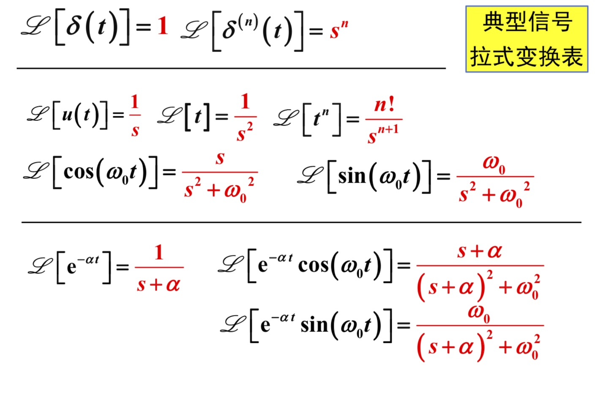

# 拉普拉斯变换的定义

$$F(s)=\mathscr{L}[f(t)]=\int_{-\infty}^{+\infty}f(t)e^{-st}dt$$

$$f(t)=\mathscr{L}^{-1}[F(s)]=\dfrac 1{2 \pi j}\int_{\sigma-j\ \infty}^{\sigma+j\ \infty}F(s)e^{st}ds$$

其中 $s=\sigma+j\omega$， 记作 $f(t) \overset{LT}{\leftrightarrow}F(s)$.

# 拉普拉斯变换的收敛域

使 $F(s)$ 存在的 $s$ 的区域称为收敛域，记为 ROC.

1. $f(t)$ 为右边信号，若对 $\sigma > \sigma_1$ 的所有实数满足  $$\lim_{t \rightarrow \infty} f(t) \cdot e^{-\sigma t}=0$$ ROC: $Re[s]=\sigma > \sigma_1$
2.  $f(t)$ 为右边信号，若对 $\sigma < \sigma_2$ 的所有实数满足  $$\lim_{t\rightarrow-\infty}f(t) \cdot e^{-\sigma t}=0$$ ROC: $Re[s]=\sigma < \sigma_2$
3. 双边信号的收敛域为两个收敛域的子集，ROC:  $\sigma_1 < \sigma < \sigma_2$.

# 常用信号的拉普拉斯变换

## 1. 阶跃函数

$$\mathscr{L}[u(t)]=\dfrac 1 s$$
ROC: $\sigma > 0$

## 2. 单边指数函数

$$\mathscr{L}[e^{-s_0t}u(t)]=\dfrac 1{s + s_0}$$
$s_0=\alpha+j\omega_0$, ROC: $\sigma > -Re[s]$ 即 $\sigma > -\alpha$.

## 3. 单位冲激信号

$$\mathscr{L}[\delta(t)]=1$$ROC: 全 $s$ 域平面收敛.

## 4. $t^nu(t)$

$$\mathscr{L}[t^nu(t)]=\dfrac{n!}{s^{n+1}}$$
ROC: $\sigma > 0$.

## 5. 三角函数

$$\mathscr{L}[{\sin(\omega_0t)}]=\dfrac{\omega_0}{s^2+\omega_0^2}$$
$$\mathscr{L}[\cos(\omega_0t)]=\dfrac{s}{s^2+\omega_0^2}$$

ROC: $\sigma>0$.

## 6. 冲击偶信号

$$\mathscr{L}[\delta’(t)]=s$$

# 拉普拉斯变换的性质

## 1. 线性性质

若 $\mathscr{L}[f_1(t)]=F_1(s)$, $\mathscr{L}[f_2(t)]=F_2(s)$，则 $\mathscr{L}[K_1f_1(t)+K_2f_2(t)]=K_1F_1(s)+K_2F_2(s)$

收敛域取交集，不包含任何一个极点.

## 2. 时移性质

若 $\mathscr{L}[f(t)]=F(s)$，则 $\mathscr{L}[f(t-t_0)u(t-t_0)]=F(s)e^{-st_0}$.

$t_0>0$，需要取单边.

## 3. s 域平移性质

若 $\mathscr{L}[f(t)]=F(s)$, 则 $\mathscr{L}[f(t)e^{-at}]=F(s+a)$.

## 4. 尺度变换性质

若 $\mathscr{L}[f(t)]=F(s)$, 则 $\mathscr{L}[f(at)]=\dfrac 1 a F(\dfrac s a), (a > 0)$

**Note**: 时移和尺度变换都有时：$\mathscr{L}[f(at-b)u(at-b)]=\dfrac 1 a F(\dfrac s a)e^{-s \frac b a}$.

## 5 卷积定理

若 $\mathscr{L}[f_1(t)]=F_1(s)$, $\mathscr{L}[f_2(t)]=F_2(s)$, $f_1(t)$, $f_2(t)$ 为有始信号，则

 $$\mathscr{L}[f_1(t) * f_2(t)]=F_1(s)F_2(s)$$
 $$\mathscr{L}[f_1(t)f_2(t)]=\dfrac 1 {2\pi j}F_1(s)*f_2(s)$$
 
## 6. 微分性质

### (1) 双边拉普拉斯变换

若 $\mathscr{L}[f(t)]=F(s)$，则 $\mathscr{L}[\dfrac{\mathrm{d}f(t)}{\mathrm{d}t}]=sF(s)$
### (2) 单边拉普拉斯变换

若 $\mathscr{L}[f(t)]=F(s)$，则 $\mathscr{L}[\dfrac{\mathrm{d}f(t)}{\mathrm{d}t}]=sF(s)-f(0_-)$

## 7. 积分性质

### (1) 双边拉普拉斯变换

若 $\mathscr{L}[f(t)]=F(s)$，则 $\mathscr{L}[\int_{-\infty}^{t}f(\tau)\mathrm{d}\tau]=\dfrac{F(s)}s$
## (2) 单边拉普拉斯变换

若 $\mathscr{L}[f(t)]=F(s)$，则 $\mathscr{L}[\int_{-\infty}^{t}f(\tau)\mathrm{d}\tau]=\dfrac{F(s)}s+\dfrac{f^{(-1)}(0_-)}s$
## 8. 初值定理

若 $f(t)$ 及 $\dfrac{\mathrm{d}f(t)}{\mathrm{d}t}$ 可以进行拉氏变换，且 $f(t) \leftrightarrow F(s)$，则 $$\lim_{t \rightarrow 0_+}f(t)=f(0_+)=\lim_{s\rightarrow \infty}sF(s)$$
**Note**: 若 $F(s)$ 不是真分式，应化为真分式+多项式形式，$F(s)$ 是真分式.

## 9. 终值定理

若 $f(t)$ 及 $\dfrac{\mathrm{d}f(t)}{\mathrm{d}t}$ 可以进行拉氏变换，且 $f(t) \leftrightarrow F(s)$，则 $$f(\infty)=\lim_{t\rightarrow \infty}f(t)=\lim_{s\rightarrow 0}sF(s)$$
终值存在只有两种情况：
1. 极点都在 s 左半平面，终值为 0；
2. **单**极点在 s=0，求终值相当于求部分分式展开式中 $\dfrac k s$ 项的系数 $k$.

## 10. s 域微分性质

若 $\mathscr{L}[f(t)]=F(s)$，则 $\mathscr{L}[tf(t)]=-\dfrac{\mathrm{d}F(s)}{\mathrm{d}s}$

推广：$\mathscr{L}[t^nf(t)]=(-1)^n\dfrac{\mathrm{d}^nF(s)}{ds^n}$

## 11. s 域积分性质*

若 $\mathscr{L}[f(t)]=F(s)$， 则 $\mathscr{L}[\dfrac{f(t)}{t}]=\int_s^\infty F(\lambda)\mathrm{d}\lambda$

要求  $\lim_{t \rightarrow 0} \dfrac 1 t f(t)$ 有界.

# 拉普拉斯变换分析电路

## 电路的 $s$ 域模型

$V_R(s)=RI_R(s)$

$V_L(s)=LsI_L(s)-Li_L(0_-)$

感抗：$Ls$

$V_C(s)=\dfrac 1 {sC}I_C(s)+\dfrac{v_C(0_-)}s$

容抗： $\dfrac 1 {sC}$

